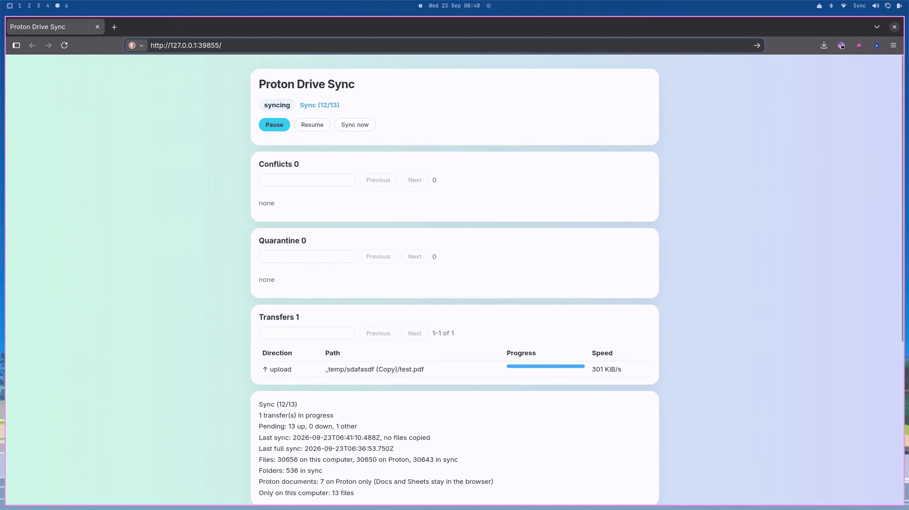

# Proton Drive Sync



Use Proton Drive Sync to keep a folder on your machine in sync with a folder in Proton Drive. When you create, edit, rename, or move a file on either side, the other side follows. If you delete a file, it is not erased: on your machine it goes to a recycle folder, and in Proton Drive it goes to Trash. A large delete or replace waits for you. If both sides change the same file, you keep both copies.

You sign in and reach Proton Drive through Proton's official [Drive SDK](https://github.com/ProtonDriveApps/sdk). The account code in this repository is a Node port of that SDK. The two-way sync on top of it is this project's own code.

Proton does not ship a sync client for Linux yet. Until Proton releases its own, you can use this unofficial plugin on Omarchy. It is not affiliated with Proton AG or the Omarchy project.

Have fun!

## Install

```sh
omarchy plugin add https://github.com/zakkoo/proton-drive-sync.git --enable
```

You get a chip on the right of the built-in bar. You need that bar. A replacement bar cannot see this plugin's service.

Then install the engine once. This builds the engine outside the plugin folder and puts `proton-drive-sync` on your PATH:

```sh
~/.config/omarchy/plugins/io.github.zakkoo.proton-drive/scripts/install-engine
```

To start it with your graphical session:

```sh
~/.config/omarchy/plugins/io.github.zakkoo.proton-drive/scripts/install-engine --service
```

## Sign in

Click the chip. Choose Sign in. A terminal opens Proton's own page, and your password stays there. Then name your local folder and your remote folder, for example `/my-files`, and confirm. Nothing is written until you do.

## Day to day

The chip tells you what the engine is doing. Open it to pause, resume, sync now, confirm or reject a held change, keep one side of a conflict, or release a file the engine refused to touch. Open folder and Open details show up while the engine is running.

`proton-drive-sync doctor` reports whether you are installed, signed in, and running. `proton-drive-sync details` prints the loopback details page for the engine you are running.

## Reinstall and restart

You update the chip and the engine separately. Update the plugin, build that folder into the engine, then restart the service so the engine you are running is the new build. Your sync folder, Proton session, and config stay.

```sh
omarchy plugin update io.github.zakkoo.proton-drive
~/.config/omarchy/plugins/io.github.zakkoo.proton-drive/scripts/install-engine
systemctl --user restart proton-drive-sync.service
```

`omarchy plugin update` fast-forwards your installed plugin to the latest published commit. If you have edited that plugin folder yourself, it is left as it is. `install-engine` replaces the engine runtime. The restart command is the background service from `install-engine --service`. If you started `proton-drive-sync` in a terminal, quit that process and start it again.

## Remove

Stop the engine while the plugin folder is still on disk:

```sh
~/.config/omarchy/plugins/io.github.zakkoo.proton-drive/scripts/remove-engine
```

Then remove the shell plugin:

```sh
omarchy plugin remove io.github.zakkoo.proton-drive
```

`omarchy plugin remove` takes the chip off your bar. It does not delete your sync folder, your Proton session, or the tool's config. `remove-engine` removes the runtime, the launcher, and this plugin's user service. Your files stay either way.

## What it needs

- Omarchy with the built-in bar. The plugin runs unsandboxed, with your user privileges, inside the shell
- Node.js 24 or newer
- A Secret Service for your Proton session, which Omarchy already runs
- `@protontech/drive-sdk`, `@protontech/crypto`, and `@parcel/watcher`, fetched by the engine installer from this repo's lockfile
- A Proton account

The project is MIT. See `LICENSE`. The adapted Proton code keeps Proton's own MIT notice in `src/remote/proton/LICENSE-proton.md`.

## Development

The engine and the reasons for it are in `src/ARCHITECTURE.md`.

```sh
npm run check
npm run test -- --project e2e
npm run test:fault
```

`./scripts/ci.sh` is the full gate. Run it on Node 24.
